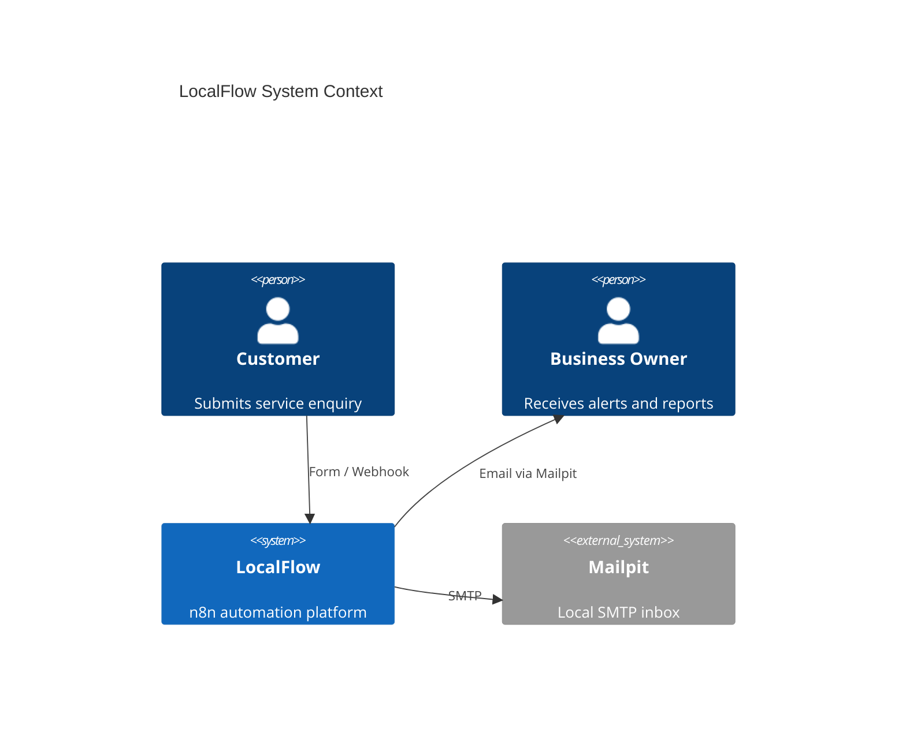
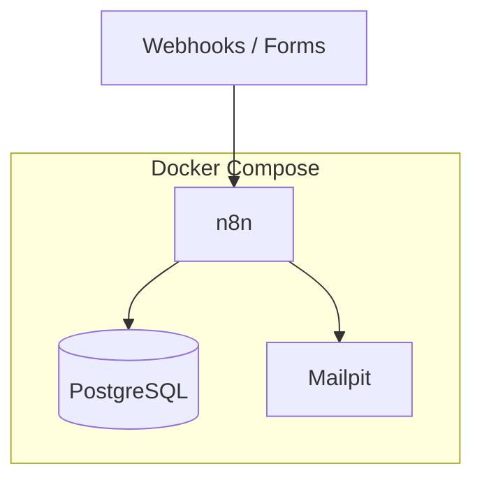
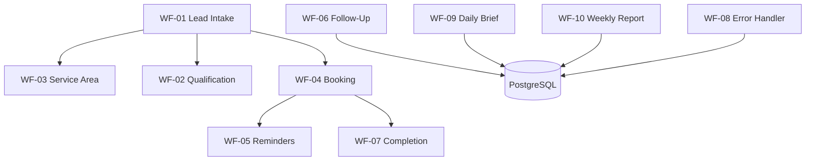

# Architecture

## System Context

LocalFlow serves a fictional local trades business receiving web/form enquiries. External actors: customers (forms/webhooks), business owner (Mailpit alerts/reports), operators (n8n UI, PostgreSQL).

## Component Diagram

## Workflow Relationships

## Lead Lifecycle

See README state machine. Transitions enforced in SQL UPDATE nodes.

## Database Design

PostgreSQL holds all business entities. n8n uses separate schema tables managed by n8n itself on the same database instance (self-hosted pattern).

See [data-model.md](data-model.md) for ER diagram.

## Communication Layer

Demo: SMTP → Mailpit. Production adapters documented for email/SMS/WhatsApp. Business logic passes recipient + template type; transport is swappable.

## Error Architecture

Any workflow can delegate failures to WF-08 via n8n error workflow setting. Errors classified, persisted, optionally retried (bounded), escalated to owner.

## Docker Architecture

Three services on `localflow` bridge network. Health checks gate n8n startup on postgres + mailpit readiness. Init SQL mounted to `/docker-entrypoint-initdb.d`.

## Production Deployment Model

- Reverse proxy (TLS termination)
- Secrets manager for `.env`
- Dedicated PostgreSQL with backups
- n8n queue mode for scale
- Webhook authentication + rate limits

## Security Boundaries

| Boundary | Demo | Production |
|----------|------|------------|
| n8n UI | Open | Basic auth / SSO |
| Webhooks | Optional secret | HMAC + HTTPS |
| Database | Docker internal | Private network |
| Email | Mailpit | Real SMTP provider |
