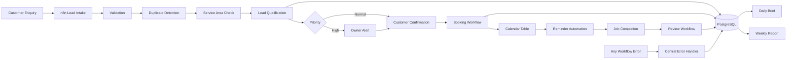

# LocalFlow — Local Service Business Automation Platform

> A production-style n8n automation case study that manages the complete lifecycle of a local service enquiry—from lead intake and qualification through booking, reminders, job completion, review requests, error handling and operational reporting.

**Fictional business:** Northampton Home Services Ltd (Northampton, UK) — plumbing, electrical, heating, and property maintenance. This is a portfolio demonstration only, not a real client deployment.

## Problem

Local service businesses often handle enquiries manually: reading forms, checking postcodes, scoring urgency, calling customers, managing calendars, sending reminders, chasing reviews, and compiling reports. This leads to missed leads, slow response times, duplicate submissions, double bookings, forgotten follow-ups, and poor operational visibility.

## Solution

LocalFlow automates the full enquiry-to-review pipeline using **n8n**, **PostgreSQL**, and **Mailpit** (local SMTP). Ten focused workflows orchestrate validation, service-area checks, qualification scoring, booking with conflict detection, idempotent reminders, follow-up sequences, job completion, centralised error handling, and scheduled reporting.

## Architecture



## Workflow Map

| ID | Workflow | Trigger | Purpose |
|----|----------|---------|---------|
| WF-01 | Lead Intake | Form + Webhook | Validate, dedupe, create lead, orchestrate |
| WF-02 | Lead Qualification | Sub-workflow | Deterministic scoring 0–100 |
| WF-03 | Service Area Check | Sub-workflow | NN1–NN12 classification |
| WF-04 | Booking Management | Webhook | Conflict detection, confirmation |
| WF-05 | Appointment Reminders | Schedule (15 min) | Idempotent 24h / 2h reminders |
| WF-06 | Lead Follow-Up | Schedule (hourly) | Recovery sequence for unbooked leads |
| WF-07 | Job Completion Review | Webhook | Thank-you, satisfaction, review/recovery |
| WF-08 | Error Handler | Error Trigger | Classify, log, alert, retry rules |
| WF-09 | Daily Operations Brief | Schedule (07:00) | Morning operational snapshot |
| WF-10 | Weekly Business Report | Schedule (Mon 08:00) | Conversion and pipeline metrics |

## Key Features

- UK phone and postcode normalisation
- Configurable service areas (PRIMARY / EXTENDED / OUTSIDE)
- Explainable qualification scoring with stored reasons
- Duplicate detection via content fingerprint + time window
- Booking overlap prevention
- Idempotent email communications via `idempotency_key`
- Lead state machine with enforced transitions
- Audit trail (`audit_events`)
- Central error workflow with retry classification
- Daily and weekly reports from live database queries

## Technology Stack

- **n8n** — workflow orchestration
- **PostgreSQL 16** — business data + n8n metadata
- **Mailpit** — local SMTP and inbox UI
- **Docker Compose** — self-hosted deployment
- **Python** — validation and demo scripts
- **GitHub Actions** — CI validation

## Business State Machine

```
NEW → VALIDATED → QUALIFIED → CONTACTED → BOOKING_PENDING → BOOKED → CONFIRMED
  → IN_PROGRESS → COMPLETED → REVIEW_REQUESTED → CLOSED
```

Alternative states: `MANUAL_REVIEW`, `OUTSIDE_SERVICE_AREA`, `DUPLICATE`, `INVALID`, `CANCELLED`, `NO_RESPONSE`, `DORMANT`, `FAILED`

## Lead Qualification

Deterministic scoring (0–100) with explainable reasons stored in JSON. Ratings: `VERY_HIGH`, `HIGH`, `MEDIUM`, `LOW`, `VERY_LOW`. Emergency keywords elevate urgency; unsupported services route to manual review.

## Quick Start

### Prerequisites

- Docker Desktop (or Docker Engine + Compose)
- Python 3.10+ (for helper scripts)

### Windows (PowerShell)

```powershell
cd local-service-automation-n8n
Copy-Item .env.example .env
docker compose up -d
python scripts/validate-workflows.py
python scripts/run-case-study-demo.py
```

### Linux / macOS

```bash
make setup && make up
make validate && make demo
```

### Access

| Service | URL |
|---------|-----|
| n8n | http://localhost:5678 |
| Mailpit | http://localhost:8025 |
| PostgreSQL | localhost:5432 |

## Workflow Import

1. Open n8n → **Settings → Import from File**
2. Import all files from `workflows/` (start with WF-02, WF-03, then WF-01)
3. Create credentials:
   - **PostgreSQL**: host `postgres`, db `localflow`, user/password from `.env`
   - **SMTP**: host `mailpit`, port `1025`, no auth
4. Activate workflows and set WF-08 as the error workflow in n8n settings

## Configuration

Business rules live in `automation_config` (PostgreSQL) and `.env`. Service areas, qualification weights, follow-up schedules, and reminder windows are configurable without editing every node.

## Testing

See [TESTING.md](TESTING.md). Run `python scripts/validate-workflows.py` and `python scripts/run-case-study-demo.py`.

## Security

See [SECURITY.md](SECURITY.md). Never commit `.env`. Production requires HTTPS, webhook authentication, and credential rotation.

## Privacy

See GDPR notes in [SECURITY.md](SECURITY.md). Demo uses synthetic data only.

## Deployment

See [docs/deployment.md](docs/deployment.md) for production considerations.

## Engineering Decisions

- **PostgreSQL as system of record** — enables CRM/calendar adapter pattern later
- **Sub-workflows** for service area and qualification — reusable, testable boundaries
- **Mailpit for all email** — safe local demo, no real customer contact
- **Idempotency keys on communications** — prevents duplicate emails on retry
- **Deterministic scoring over AI** — optional AI enrichment documented but disabled by default

## Limitations

- Workflows must be imported and credentials configured manually in n8n
- Google Calendar integration is designed but not required for demo
- AI enrichment is optional and off by default
- Demo metrics reflect synthetic seed data, not real business outcomes

## Skills Demonstrated

n8n workflow architecture · business process automation · webhooks · form processing · PostgreSQL · Docker · scheduling · state machines · deduplication · idempotency · error handling · reporting · documentation · privacy awareness

## License

MIT — see [LICENSE](LICENSE)

## Repository Structure

```
local-service-automation-n8n/
├── workflows/          # n8n workflow exports
├── database/init/      # Schema, indexes, demo data
├── scripts/            # Validation, demo, generators
├── docs/               # Detailed documentation
└── demo/               # Sample payloads and scenarios
```

For the full case study narrative, see [CASE_STUDY.md](CASE_STUDY.md) and [ARCHITECTURE.md](ARCHITECTURE.md).
