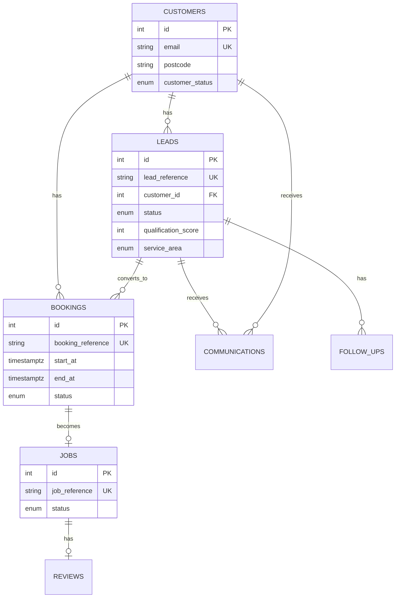

# Data Model

## Entity Relationship Diagram

## Tables

| Table | Purpose |
|-------|---------|
| `customers` | Contact and address records |
| `leads` | Enquiry pipeline with qualification |
| `bookings` | Scheduled appointments |
| `jobs` | Completed work units |
| `communications` | Email/SMS audit with idempotency |
| `follow_ups` | Scheduled nurture messages |
| `reviews` | Satisfaction and review requests |
| `audit_events` | State change trail |
| `workflow_runs` | Automation execution log |
| `workflow_errors` | Failure tracking |
| `reporting_snapshots` | Stored report metrics |
| `automation_config` | Runtime business settings |
| `service_definitions` | Supported service catalogue |
| `technicians` | Fictional staff for scheduling |

## Reference Formats

- Leads: `LEAD-YYYY-NNNNNN`
- Bookings: `BOOK-YYYY-NNNNNN`
- Jobs: `JOB-YYYY-NNNNNN`

Generated via PostgreSQL functions `generate_lead_reference()`, etc.

## Indexes

See `database/init/002-indexes.sql` for query optimisation on status, fingerprints, booking times, and reminder eligibility.
